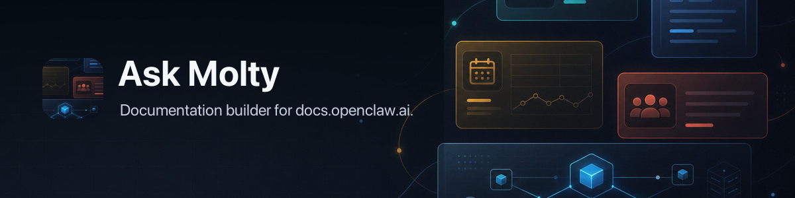

# Ask Molty

Ask Molty is the OpenClaw documentation agent.

It owns:

- the Cloudflare Worker behind `docs-chat.openclaw.ai`
- the system prompt and tool loop
- static workspace export for docs, source, and GitHub issues/PRs
- retrieval artifacts consumed by the Worker

The docs mirror stays focused on publishing documentation. Ask Molty owns the agent runtime.

## Architecture

`scripts/export-workspace.ts` builds a flat, read-only workspace:

```text
dist/ask-molty/
  docs-search.jsonl
  source-search.jsonl
  github-search.jsonl
  workspace-manifest.json
  workspace/
    docs/*.md
    source/*.md
    github/*.md
```

The Worker does deterministic candidate retrieval, mounts the best docs/source/GitHub files into a small in-memory workspace, then lets the model call:

- `search_workspace`
- `read_workspace`
- `list_workspace`
- `run_shell`

Docs are canonical. Source is implementation truth. GitHub issues/PRs are discussion and status evidence.

`run_shell` is deliberately fake and read-only. It supports `rg`, `grep`, `cat`, `head`, `ls`, and `find` over mounted files only. No pipes, redirects, writes, network, or process execution.

## Local Build

```bash
npm install
npm run check
```

The exporter defaults to sibling/local paths:

- docs mirror: `../docs-openclaw`
- OpenClaw source: `../clawdbot5`
- gitcrawl store DB: `~/.config/gitcrawl/stores/gitcrawl-store/data/openclaw__openclaw.sync.db`

Override with:

```bash
ASK_MOLTY_DOCS_REPO=../docs-openclaw \
ASK_MOLTY_SOURCE_REPO=../clawdbot5 \
ASK_MOLTY_GITCRAWL_DB=~/.config/gitcrawl/stores/gitcrawl-store/data/openclaw__openclaw.sync.db \
npm run export
```

The generated workspace can be large because GitHub threads are sharded into markdown files. The Worker never downloads all of it per request; it loads small JSONL indexes, selects candidates, and only mounts the best matching docs/source/GitHub files.

## Deploy

The Worker expects `OPENAI_API_KEY` as a Cloudflare Worker secret. The default model is `chat-latest`, which OpenAI maps to GPT-5.5 Instant in the API.

Docs chat auth is brokered through ClawHub:

- `CLAWHUB_AUTH_URL` sends users to `https://hub.openclaw.ai/docs/auth`.
- Corpus and workspace URLs default to `https://docs.openclaw.ai`; the legacy
  documentation host remains routed only for compatibility.
- `CLAWHUB_SESSION_VERIFY_URL` verifies the ClawHub Convex Auth token once.
- `ASK_MOLTY_AUTH_SECRET` signs the docs-only session cookie; set it in production so OpenAI key rotation does not invalidate sessions.

```bash
npm run deploy
```
